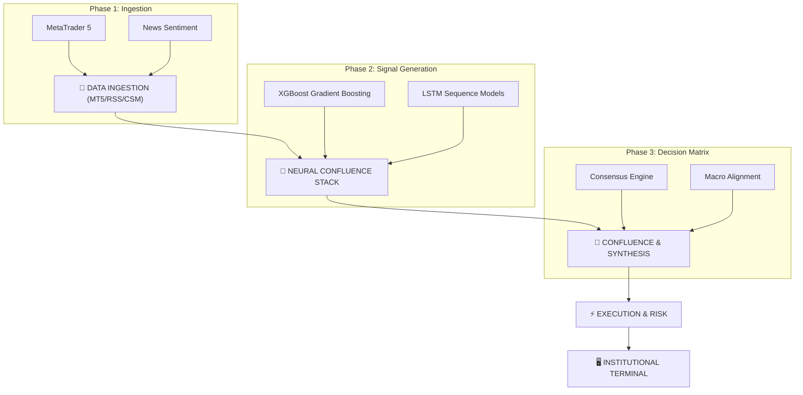

# 🌌 APEX Trade AI: Institutional Intelligence OS
*Deterministic Alpha | Multi-Asset Confluence | Blockchain-Verified Oracle*

---


## 🏛️ Executive Summary
**APEX Trade AI** is a high-fidelity **Institutional Intelligence Operating System (IIOS)** engineered for global financial markets. By synthesizing real-time macro-sentiment, ensemble machine learning, and Smart Money Concept (SMC) heuristics, APEX provides a centralized command interface for professional-grade market navigation.

---

## 🏛️ Full System Whitepaper & Audit
For a deep dive into the mathematical foundations, machine learning ensemble theory, and algorithmic SMC heuristics, please refer to the **Comprehensive 20-Page Technical Whitepaper**:

👉 **[View Full System Audit & Whitepaper](docs/whitepaper/README.md)**

---

## 🔄 System Workflow & Architecture



---

## ⚡ Deployment & Reliability

### Production (Windows Service via NSSM)
The APEX pipeline runs as a **resilient Windows Service** that starts automatically on boot, survives log-off/sleep, and self-heals by auto-restarting on crashes.

**Start the Pipeline Service:**
```powershell
Start-Service ApexTradingPipeline
```

**Check Status:**
```powershell
Get-Service ApexTradingPipeline
# Or view Dashboard: BottomStatus bar shows 🟢 HEALTHY / 🟡 DEGRADED / 🔴 ERROR
```

**View Deployment Logs:**
```powershell
# Real-time tail of the pipeline runner
Get-Content logs/pipeline.log -Wait -Tail 50
```

**Reload After Config Change:**
```powershell
Restart-Service ApexTradingPipeline
```

---

## ⏱️ Session-Aware Refresh Cadence
The pipeline automatically scales its heartbeat based on global market sessions (configured in `src/config/config.yaml`).

| Session | Time (UTC) | Refresh Interval |
| :--- | :--- | :--- |
| **Asian** | 00:00 - 08:00 | Every 15 min |
| **London** | 08:00 - 13:00 | Every 10 min |
| **Overlap (Peak)**| **13:00 - 17:00** | **Every 5 min** |
| **New York** | 17:00 - 22:00 | Every 10 min |
| **Off-Hours** | 22:00 - 00:00 | Every 15 min |

---

## 🚨 Real-time Observability & Alerts
The system includes a production-grade monitoring stack out of the box.

*   **Safe Mode**: If MT5 disconnects, the system enters `DEGRADED` mode, preserving the last valid signal instead of crashing.
*   **Webhook Alerts**: Supports Slack/Teams notifications for persistent failures.
    - Set `APEX_ALERT_WEBHOOK` environment variable via NSSM.
    - `nssm set ApexTradingPipeline AppEnvironmentExtra "APEX_ALERT_WEBHOOK=https://hooks.slack.com/..."`
*   **Recovery Alerts**: Automatically notifies you when a failing pipeline self-heals.
*   **Verification CLI**: Run `python -m src.pipeline.health --test-alert` to verify your webhook instantly.

---

## 🧬 Intelligence Modules

- **Smart Money Concepts (SMC)**: Automated localization of Order Blocks (OB), Fair Value Gaps (FVG), and Market Structure Shifts (MSS).
- **Neural Confluence**: Blended XGBoost + LSTM ensemble with a deterministic **80% probability threshold**.
- **Kelly Criterion**: Dynamic position sizing based on real-time win probability and Reward-to-Risk.
- **Blockchain Verified**: Every high-confluence signal is SHA-256 fingerprinted and anchored on the **Polygon Amoy Testnet** for transparency.

---

### 🏛️ Security & Audit Transparency
Performance history is immutable. The APEX Ledger ensures that past signals cannot be altered, providing a verifiable record of institutional alpha.

---
*Powered by Aditya | APEX Intelligence Engine v2.5.0 Elite*
