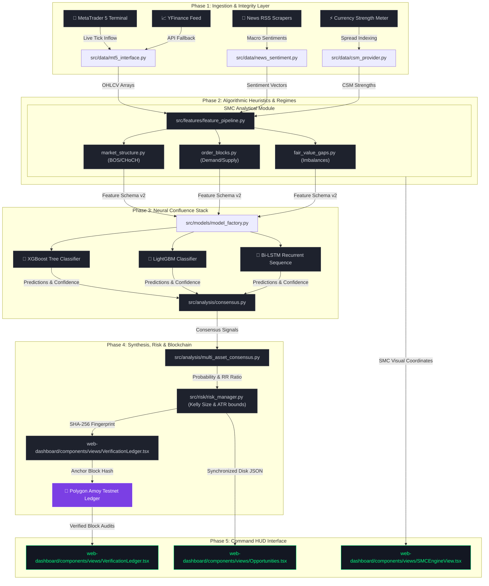

# 🌌 APEX Trade AI: Institutional Intelligence OS
*Deterministic Alpha | Multi-Asset Confluence | Neural Ensemble | Blockchain-Verified Oracle*

---

[](#)
[](#)
[](#)
[](#)
[](https://creativecommons.org/licenses/by-nc-sa/4.0/)

**APEX Trade AI** is a highly optimized, production-grade **Institutional Intelligence Operating System (IIOS)** engineered for professional-grade market navigation. By synthesizing real-time macro-sentiment signals, ensemble machine learning architectures, and algorithmic Smart Money Concepts (SMC) heuristics, APEX provides a centralized command terminal that shifts trading from discretionary guesswork to deterministic engineering.

---

## 🏛️ Comprehensive Full-System Whitepaper
For a deep dive into the mathematical foundations, machine learning ensemble theory, and algorithmic SMC heuristics, please refer to our comprehensive technical auditing files:

👉 **[View Full System Audit & Whitepaper](docs/APEX_SYSTEM_AUDIT_V2.5_ELITE.md)** | **[Asset Calibration Plan](docs/asset_calibration_plan.md.resolved)**

---

## 🌌 Core System Capabilities

### 1. High-Fidelity Data Ingestion Layer (`src/data/`)
* **MetaTrader 5 API integration**: Multi-Timeframe (MTF) candle fetching with resilient exponential backoff retry logic.
* **Resilient Fallback Engines**: High-performance fallback routines utilizing `yfinance` APIs and rotating local CSV matrices in `data/` if MT5 terminal disconnects.
* **Macro Indicators & Scrapers**: Currency Strength Meter (CSM), standard DXY indices tracker, and ForexFactory economic news calendars.
* **Geopolitical & News Sentiment**: Real-time RSS sentiment extraction equipped with **exponential decay functions** to eliminate concept drift.

### 2. Algorithmic SMC Heuristics Engine (`src/features/smc/`)
* **Market Structure shifts (MSS)**: Real-time tracking of high-probability **BOS (Break of Structure)** and **CHoCH (Change of Character)** across all major assets.
* **Order Block (OB) Localization**: Dynamic, real-time mapping of unmitigated institutional demand (Bullish OB) and supply (Bearish OB) zones.
* **Imbalance Detection (FVG)**: Auto-calculation of Fair Value Gaps to serve as resting liquidity magnets and stop-loss barriers.
* **Liquidity Sweeps & Pools**: Identifies wicks/stop-hunts and equal highs/lows (EQH/EQL) for precision entry targets.

### 3. Machine Learning Ensemble (`src/models/` & `tools/production/`)
* **Ensemble Confluence Stack**: Multi-model consensus pooling gradient classifiers (XGBoost + LightGBM) with sequence recurrent neural networks (Bi-LSTM).
* **Cross-Validation Safeguards**: Strict 100-candle purging cross-validation gaps to prevent look-ahead bias and training overlap.
* **Probability Gating**: Trade entry signals are suppressed until the final Neural Confluence Fusion reaches an operational **80% precision threshold**.

### 4. Risk Fortress Engine (`src/risk/`)
* **Modified Kelly Criterion Sizing**: Micro-calibrated position sizing targeting optimal logarithmic capital growth.
* **ATR-Scaled Target Bounds**: Stop-Loss (SL) and Take-Profit (TP) levels dynamically adjusted using Average True Range (ATR) to endure active session volatility.
* **Strict Capital Caps**: Institutional ceiling strictly capping max exposure to **2% per asset**.

### 5. Blockchain Signals Ledger (`src/blockchain/`)
* **Signal Fingerprinting**: SHA-256 secure hashing applied to all emitted high-confluence opportunities.
* **Polygon Amoy Anchoring**: Hashes are written immutably on a public testnet blockchain to establish an unalterable performance audit trail.

### 6. Liquid Glass Command Terminal (`web-dashboard/`)
* **Heavy Glassmorphism HUD**: Responsive, GPU-accelerated Tailwind/Next.js dashboard styled using high-end cyberpunk design system.
* **Async Cache Synchronization**: Zero-API bottlenecks. The Python daemon writes static JSON updates to `data/` which the Next.js HUD parses instantly, ensuring 100% terminal uptime.

---

## 🏛️ System Orchestration Architecture



---

## 🛠️ Complete Technology Stack

| Layer | Tools & Frameworks | Purpose |
| :--- | :--- | :--- |
| **Backend Core** | Python 3.12+ | Analytical pipeline processing and scripting. |
| **Ingestion Feed** | MetaTrader 5 (MT5 API), `yfinance` | High-fidelity real-time data streaming. |
| **Numerical/Data**| Pandas, Numpy, PyArrow (Apache Parquet) | Volatility indexing and matrix manipulations. |
| **Machine Learning**| TensorFlow/Keras, LightGBM, XGBoost, Scikit-learn | Tree ensemble classifiers and Bi-LSTM neural networks. |
| **SMC Engines** | Customized vector math algorithms | Algorithmic MSS, OB, FVG, and liquidity pool detection. |
| **Blockchain** | `web3.py` (Polygon Amoy Testnet integration) | Immutably auditing signal fingerprinted metadata. |
| **Frontend HUD** | Next.js 15+ (App Router), React, Lucide Icons | GPU-accelerated institutional Command Dashboard. |
| **Styling Systems**| Tailwind CSS, Heavy CSS Glassmorphic effects | Designing the premium "Liquid Glass" dark HUD interface. |
| **Persistence** | NSSM (Non-Sucking Service Manager) | 24/7 background Windows Service operation. |

---

## ⚙️ Mathematical Foundations

### 1. News Sentiment Exponential Decay
To avoid lagging inputs, RSS financial feeds are decayed mathematically. Sentiments recorded $t$ seconds ago are scaled:

$$S(t) = S_0 \cdot e^{-\lambda t}$$

*Where:*
* $S_0$ = Raw scraped sentiment score.
* $\lambda$ = Half-life decay coefficient (news decays sharply over operational NY/London overlap hours).

### 2. SMC Confluence Score ($C_s$)
SMC events are mapped dynamically across a timeframe array $T$ to establish trend inertia:

$$C_s = \sum_{tf \in T} \left( W_{mss} \cdot MSS_{tf} + W_{ob} \cdot OB_{tf} + W_{fvg} \cdot FVG_{tf} \right)$$

*Where:*
* $T$ = Set of active timeframes (`1d`, `4h`, `1h`).
* $MSS_{tf}$, $OB_{tf}$, $FVG_{tf}$ = Normalized binary matrices (0 or 1).
* $W$ = Configured asset weights loaded from `src/config/assets.yaml`.

### 3. Neural Confluence Fusion Probability ($P_{final}$)
The meta-learner consensus aggregates individual model signals combined with the SMC engine:

$$P_{final} = \alpha \cdot P_{xgboost} + \beta \cdot P_{lightgbm} + \gamma \cdot P_{lstm} + \delta \cdot C_s$$

*Where:*
* $P_{final}$ must exceed **$\ge 0.80$** for a BUY or SELL signal to be escalated to the active Command HUD execution panels.

### 4. Modified Kelly Criterion Position Sizing
Position sizes are dynamically sized to maximize portfolio growth rate:

$$f^* = \text{Multiplier} \cdot \frac{P_{final} \cdot (b + 1) - 1}{b}$$

*Where:*
* $f^*$ = Staged fraction of the active balance.
* $b$ = Dynamic Reward-to-Risk ratio calculated using structural Order Blocks and ATR targets.
* $\text{Multiplier}$ = Capped fractional sizing (e.g., Quarter-Kelly) to secure absolute drawdown limits.

---

## 📂 Project Directory Structure

```text
Aditya0292/Fintech-Apex-intelsystem/
│
├── data/                         # Disk Synchronized JSONs & CSV repositories
│   ├── prices/                   # Live MT5 price exports
│   ├── pipeline_health.json      # Shared health status file parsed by Dashboard
│   └── prediction_cache.json     # Multi-timeframe opportunities cache
│
├── docs/                         # Whitepaper audits, master HUD styling prompts
│   ├── APEX_SYSTEM_AUDIT_V2.5_ELITE.md
│   ├── apex_ui_master_prompt.md.resolved
│   └── asset_calibration_plan.md.resolved
│
├── saved_models/                 # Versioned model trees & neural checkpoints
│   ├── xgboost_model_USDJPY_1d.json
│   ├── lightgbm_model_USDJPY_1d.txt
│   └── bilstm_model_USDJPY_1d.keras
│
├── src/                          # APEX CORE BACKEND PIPELINE
│   ├── analysis/                 # Multi-Asset Consensus Engines
│   ├── blockchain/               # Polygon Web3 ledger integrations
│   ├── config/                   # System assets.yaml and configuration files
│   ├── data/                     # Ingestion feeds (MT5, News sentiments, CSM)
│   ├── features/                 # Technical/SMC feature pipeline
│   ├── models/                   # Neural network training configurations
│   ├── pipeline/                 # Core service daemon & session heartbeats
│   ├── risk/                     # Position sizing and ATR barriers
│   └── utils/                    # Config loaders and rotation logging handlers
│
├── tools/                        # PRODUCTION DEPLOYMENT & TESTING CLI TOOLS
│   ├── backtesting/              # Backtesting, evaluation & plotting scripts
│   ├── data_fetch/               # Historical data scrapers & calendars
│   ├── production/               # Production daemons, predictors & executers
│   └── verification/             # Model distribution validators
│
├── web-dashboard/                # NEXT.JS Cyber-Glass Command Terminal
│   ├── app/                      # Next.js App Router API & pages
│   ├── components/               # Tactical HUD panels, charts & sidebars
│   ├── context/                  # Global React contexts for state tracking
│   └── hooks/                    # Live asynchronous fetching hooks
│
├── START_APEX.bat                # Direct double-click launch shortcut
└── requirements.txt              # Standard system Python dependencies
```

---

## ⚡ Deployment & Running Guide

### 1. Ingestion Engine Setup (Backend Python)
Ensure you are in the workspace root directory:

```powershell
# Create virtual environment
python -m venv .venv
.venv\Scripts\Activate.ps1

# Install requirements
pip install -r requirements.txt
```

**Run Single/All Predictions:**
```powershell
# Get XAUUSD predictions for 1h/4h/1d
python tools/production/predict_all.py --assets XAUUSD

# Predict all assets bypassing MetaTrader 5 UI (YFinance offline mode)
python tools/production/predict_all.py --assets all --no-mt5
```

**Validate Models & Assets:**
```powershell
# Run pre-flight distributions checks
python tools/verification/pre_flight_check.py
```

### 2. Next.js HUD Interface Setup (Frontend Dashboard)
Navigate into the dashboard folder:

```powershell
cd web-dashboard

# Install node dependencies
npm install

# Run the development command HUD (Safe mode)
npm run dev:safe
```

### 3. Deploying 24/7 Background Service (Windows Deployment)
To ensure the pipeline operates seamlessly 24/7 without user logging sessions, APEX comes with a preconfigured background daemon operating via **NSSM (Non-Sucking Service Manager)**:

```powershell
# Install background Windows Service using PowerShell script
Powershell.exe -ExecutionPolicy Bypass -File tools/setup_service.ps1
```

Once installed, the background daemon self-heals in case of core process interrupts, logging errors strictly to `logs/daemon_log.txt`.

* **Engage Service:** `Start-Service ApexTradingPipeline`
* **Halt Service:** `Stop-Service ApexTradingPipeline`
* **Restart Service:** `Restart-Service ApexTradingPipeline`

---

## ⏱️ Dynamic Session-Aware Refresh Cycles

The system optimizes background computations based on active global financial market trading hours:

| Session | Time Range (UTC) | Polling Frequency | Operational Focus |
| :--- | :--- | :--- | :--- |
| **Asian Session** | 00:00 - 08:00 | **Every 15 min** | Low-volatility ranging regimes; power conservation. |
| **London Session**| 08:00 - 13:00 | **Every 10 min** | European breakout tracking. |
| **London/NY Overlap** | **13:00 - 17:00** | **Every 5 min** | **Peak Volatility; real-time high-impact news sweeps.** |
| **New York Session**| 17:00 - 22:00 | **Every 10 min** | Trend consolidation and structural target fill tracking. |
| **Off-Hours Close**| 22:00 - 00:00 | **Every 15 min** | Heartbeat checking, full pipeline rebuilds, model retrain. |

---

## 🚨 Uptime Observability & Fault Tolerance

* **Degraded "Safe Mode"**: If your MT5 terminal drops connection, the `PipelineHealthMonitor` transitions the system state to `DEGRADED`, locking in the last valid predicted outputs. This prevents dashboard UI panic screens or ghost signals.
* **Persistent Discord/Slack webhook Alerts**: Dispatch high-priority warnings to your support channels if pipeline failure runs persist for $>3$ consecutive cycles. Set using NSSM parameters:
  `nssm set ApexTradingPipeline AppEnvironmentExtra "APEX_ALERT_WEBHOOK=https://hooks.slack.com/services/..."`
* **Self-Healing Recovery Alerts**: Automatically broadcasts a recovery log notification once the underlying data layer re-establishes connectivity.

---
*Developed by Aditya | APEX Intelligence Engine v2.5.0 Elite*
