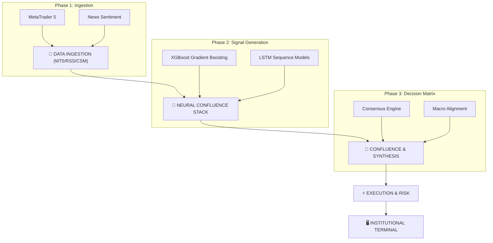

# 🌌 APEX Trade AI: Institutional Intelligence OS
*Deterministic Alpha | Multi-Asset Confluence | Blockchain-Verified Oracle*

---


## 🏛️ Executive Summary
**APEX Trade AI** is a high-fidelity **Institutional Intelligence Operating System (IIOS)** engineered to identify liquidity voids and directional bias in global financial markets. By synthesizing real-time macro-sentiment, machine learning probabilistic models, and Smart Money Concept (SMC) heuristics, APEX provides a centralized command interface for professional-grade market navigation.

> [!IMPORTANT]
> **Trust Infrastructure:** All primary analytical insights and trade signals are SHA-256 fingerprinted and anchored on the **Polygon Amoy Testnet** for immutable performance auditing.

---

## 🔄 System Workflow & Architecture
*Architecture Blueprint (Napkin AI Conceptual Visualized via Mermaid)*



---

## 🔬 Mathematical Foundation

### 1. Deterministic Risk: The Kelly Criterion
The system optimizes position sizing using a modified Kelly Criterion to maximize logarithmic growth of the bankroll while mitigating the risk of ruin:
$$f^* = \frac{p(b+1) - 1}{b}$$
*Where:*
- $f^*$: The optimal fraction of the bankroll to risk.
- $p$: Probability of win (sourced from the Neural Confluence confidence score).
- $b$: Payoff odds (Calculated Reward-to-Risk ratio).

### 2. Neural Confluence: Gradient Boosting Logic
Our directional bias is refined through an **XGBoost** objective function that minimizes log-loss while penalizing complexity (L1/L2 regularization) to prevent over-fitting in highly volatile market environments:
$$\text{Obj}(\theta) = \sum_{i} l(y_i, \hat{y}_i) + \sum_{k} \Omega(f_k)$$
The system achieves precision by ensuring **Probability $\ge 80\%$** before escalating to a "High Confluence" signal state.

---

## 📟 Live Terminal Preview
*Real-time trace of the APEX Analytical Engine (Simulation)*

```bash
[14:22:01] INF: Initializing Market Uplink... MT5 CONNECTED.
[14:22:05] INTEL: XAUUSD (GOLD) Detects Liquidity Void @ 2145.50 - 2148.00
[14:22:10] SMC: Market Structure Shift (MSS) Detected (15m Timeframe)
[14:22:15] ML: XGBoost Signal [BULLISH] | LSTM Confidence [89.4%]
[14:22:20] MAC: Multi-Asset Consensus Score: 92.4 (Rank #1)
[14:22:25] LEDGER: Anchoring Insight Hash to Polygon... TX: 0xf9a3...d71e
[14:22:30] STATUS: Opportunity Runway UPDATED. Strategy: [STRONG BUY]
```

---

## 🚀 Key Intelligence Modules

### 🏛️ Smart Money Concepts (SMC) Engine
*   **Order Block Localization**: Identifies institutional supply/demand zones through automated price-action profiling.
*   **Market Structure Shifts (MSS)**: pinpoints the exact moment high-timeframe trend inertia transitions into actionable entry setups.
*   **Fair Value Gaps (FVG)**: Monitors price imbalances as magnets for future liquidation and rebalancing.

### 🧠 Tactical News Oracle
*   **Sentiment Decay Models**: Implements an exponential decay function ($e^{-\lambda t}$) ensuring that breaking macro-events exert a higher influence than stale historical records.
*   **Asset-Specific Anchoring**: Differentiates between Base-rate events and Quote-currency shocks (e.g., distinguishing CPI impacts on EUR vs USD).

---

## ⚡ Quick-Start API Reference
The APEX Backend provides a RESTful interface for external tool integration.

### **GET /api/predict_all**
Returns the current prioritized "Opportunity Runway".
```json
{
  "assets": {
    "XAUUSD": {
      "bias": "BULLISH",
      "confidence": 0.912,
      "levels": { "tp": 2240.5, "sl": 2195.2 },
      "smc": { "ob_found": true, "mss": "Confirmed" }
    }
  },
  "ranking": [ "XAUUSD", "EURUSD" ]
}
```

---

## 📁 Project Hierarchy
| Directory | Purpose |
| :--- | :--- |
| **`web-dashboard/`** | Next.js 15+ Institutional Command Terminal |
| **`src/`** | Core Predictive Engines & SMC Logic |
| **`tools/`** | Data Ingestion & Backtesting Pipelines |
| **`docs/`** | Institutional Audits & PDF SitReps |
| **`outputs/`** | Validated Intelligence Artifacts (JSON) |
| **`logs/`** | Deterministic Run-time Audit Logs |

---

## 🗺️ 2026 Development Roadmap

### **Phase 4: HFT & Specialized Execution**
- Integration of FPGA-accelerated price-action feeds.
- Sub-millisecond latency optimization for scalp-mode execution.

### **Phase 5: Decentralized Intelligence (DAO)**
- Implementation of Federated Model Training via the APEX DAO.
- Federated model checkpoints anchored on Celestia or Avail for data availability.

---

## 🛠️ Contribution & Development
We maintain institutional-grade code quality. All pull requests must:
1.  **Pass Model Validation**: Precision must exceed 80% on out-of-sample data.
2.  **Linting**: Adhere to PEP8 (Python) and ESLint (Next.js) standards.
3.  **Audit**: New analytical modules must include a deterministic hashing verification test.

---

### 🏛️ Security & Audit Transparency
All signals are verified through the **Polygon Amoy Proof-of-Signal** service. Performance history is immutable, ensuring that the APEX Ledger cannot be back-dated or altered post-execution.

---
*Powered by Aditya | APEX Intelligence Engine*
