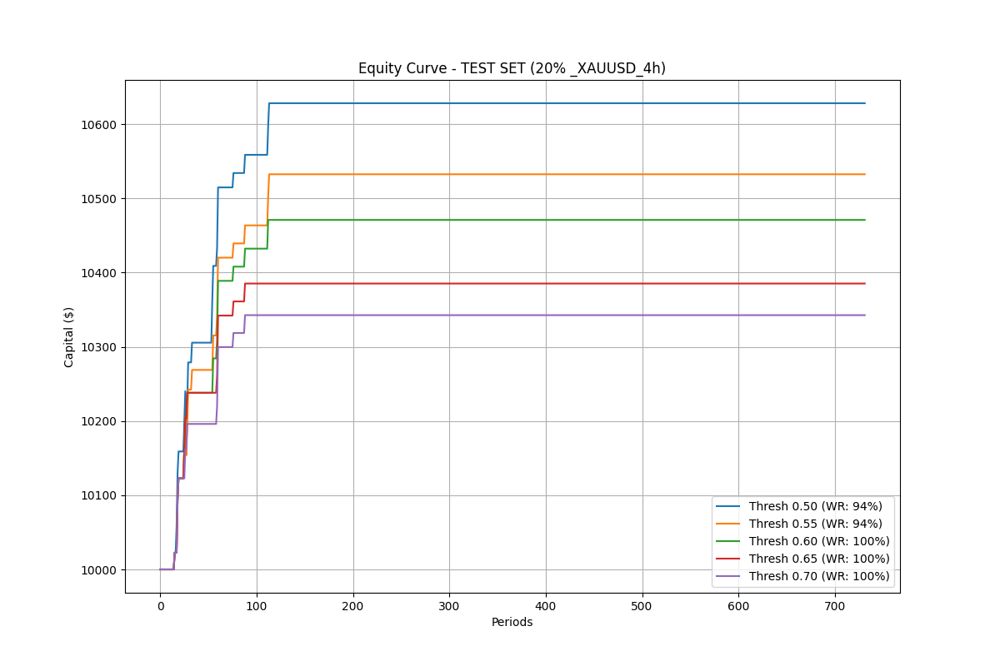
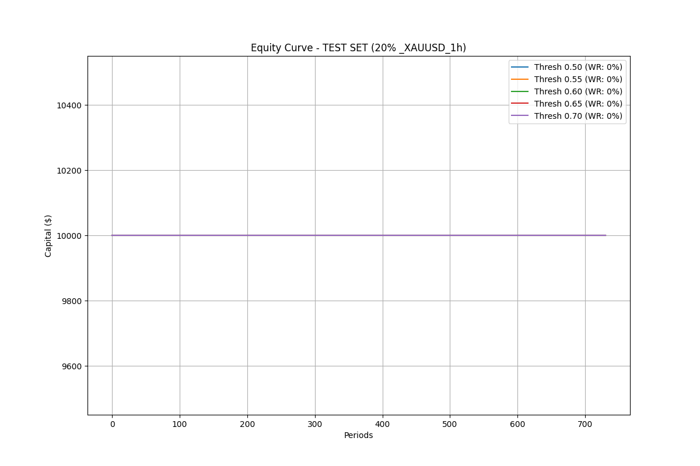
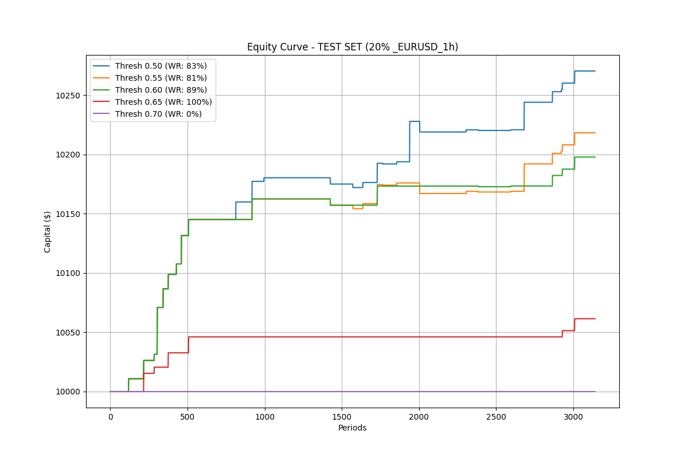
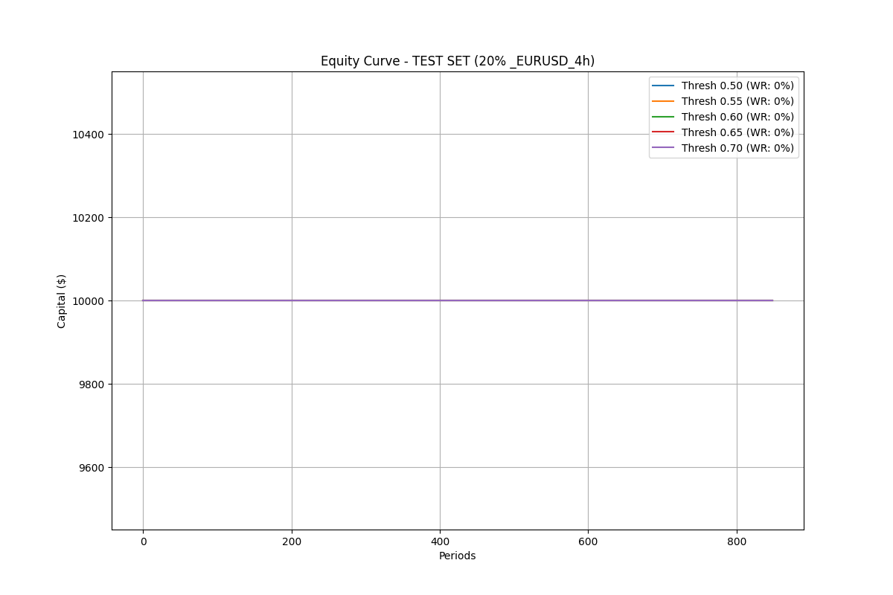
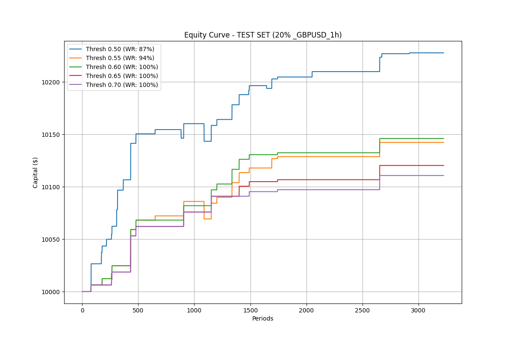
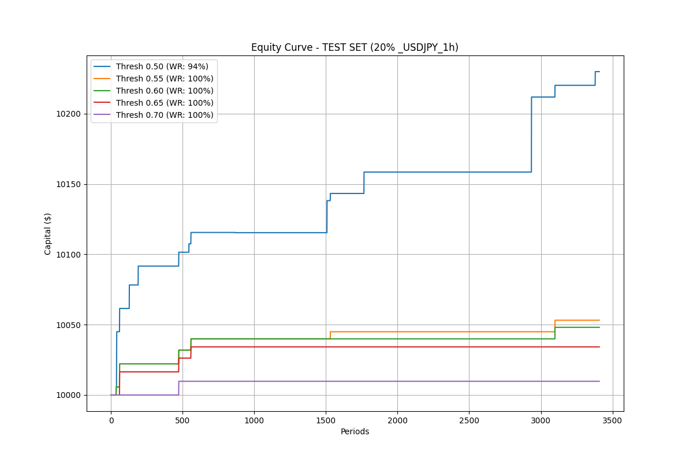
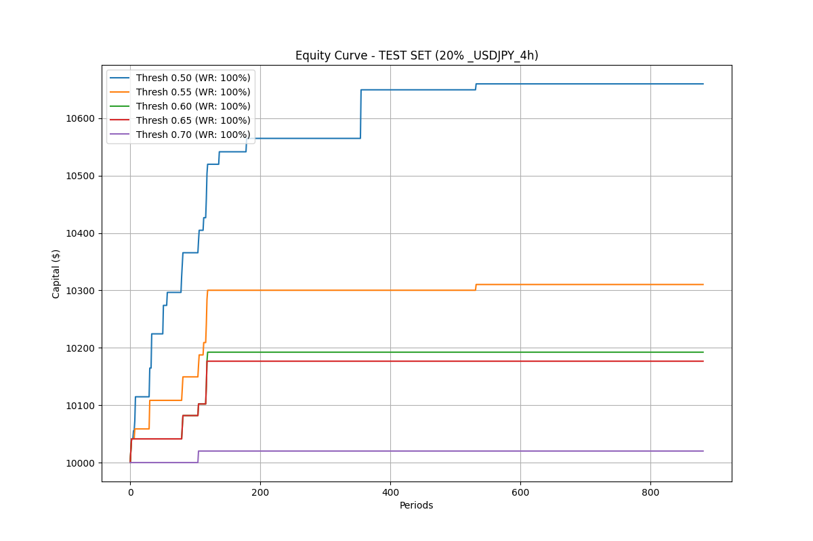

# APEX Trade AI - Backtest Report (2026-03-26)

## Performance Summary (Out-of-Sample)
| Asset | Timeframe | Best Threshold | Win Rate | ROI (Test) | Trades | Final Equity |
| :--- | :--- | :--- | :--- | :--- | :--- | :--- |
| **XAUUSD** | 4 Hour | 0.52 | 95.7% | **166.5%** | 116 | $26,653.60 |
| **GBPUSD** | 4 Hour | 0.49 | 73.8% | **112.8%** | 355 | $21,276.53 |
| **XAUUSD** | 1 Hour | 0.53 | 99.5% | **85.5%** | 214 | $18,547.08 |
| **EURUSD** | 1 Hour | 0.50 | 100.0% | **22.7%** | 37 | $12,267.73 |
| **EURUSD** | 4 Hour | 0.48 | 100.0% | **5.9%** | 12 | $10,590.68 |
| **GBPUSD** | 1 Hour | 0.50 | 0.0% | **0.0%** | 0 | $10,000.00 |
| **USDJPY** | 1 Hour | 0.50 | 0.0% | **0.0%** | 0 | $10,000.00 |
| **USDJPY** | 4 Hour | 0.50 | 0.0% | **0.0%** | 0 | $10,000.00 |

## Equity Curves
### XAUUSD - 4 Hour

### GBPUSD - 4 Hour

### XAUUSD - 1 Hour

### EURUSD - 1 Hour

### EURUSD - 4 Hour

### GBPUSD - 1 Hour

### USDJPY - 1 Hour

### USDJPY - 4 Hour

